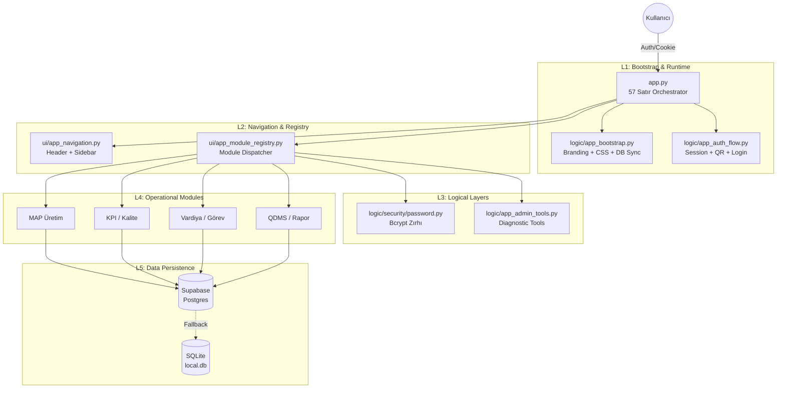
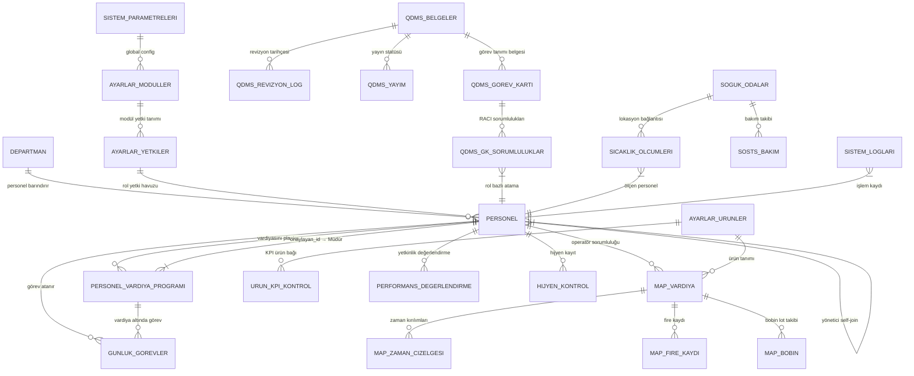
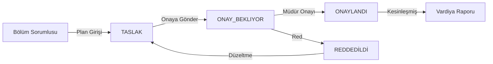
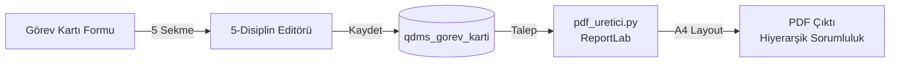

# 🗺️ EKLERİSTAN QMS — Master Sistem Haritası (v6.2.0)

**Path:** `.antigravity/musbet/hafiza/sistem_haritasi.md`
**Durum:** CANLI (Single Source of Truth)
**Son Güncelleme:** 2026-04-16 | Grand Unification Refactor

---

## 🏛️ 1. GENEL MİMARİ (v6.2.0 Modular)

Sistem, "Grand Unification" refaktörü sonrası 6 ana katmana ayrılmış, zırhlı ve modüler bir yapıdadır.



---

## 🗃️ 2. VERİTABANI VARLIKİLİŞKİLERİ (ERD — Tam)

35+ tablo arasındaki tüm kritik bağlantılar:



---

## 🚀 3. SİSTEM BÖLGELERİ (ZONES) — Tam Modül Listesi

Anayasa v5.0 uyarınca sistem 3 ana bölgeye ayrılmıştır:

| Bölge (Zone) | Erişim Anahtarı | Sorumlu Rol | Modüller |
| :--- | :--- | :--- | :--- |
| **Operations** | `ops` | Bölüm Sorumlusu, Operatör | Vardiya, MAP Üretim, Soğuk Oda, KPI, Hijyen, GMP, Günlük Görev |
| **Management** | `mgt` | Müdür, Şef | QDMS, Raporlama, Performans/Polivalans |
| **System** | `sys` | Admin | Personel, Ayarlar, Yetki, Global Parametreler |

> [!NOTE]
> `zone_yetki.py` sıfır DB sorgusuyla çalışır — tüm yetki haritası session başında RAM'e yüklenir (`st.session_state['yetki_haritasi']`).

---

## 👥 4. MODÜL: PERSONEL (İK) & YETKİLENDİRME (AUTH)

**Dosyalar:** `ui/ayarlar/personel_ui.py` (472 satır), `logic/auth_logic.py` (586 satır), `logic/security/password.py` (111 satır), `logic/app_auth_flow.py` (120 satır)

### 🔗 İlişki Matrisi

| # | İlişki Tanımı | Tür | Teknik Detay |
| :--- | :--- | :--- | :--- |
| **1** | **Departman Hiyerarşisi** | **FK** | `personel.departman_id` → `ayarlar_bolumler.id` |
| **2** | **Yönetimsel Bağ (Self-Join)** | **FK** | `personel.yonetici_id` → `personel.id` (RACI Sorumlusu) |
| **3** | **Kimlik Doğrulama** | **Logic** | `personel.sifre_hash` ↔ `auth_logic.py` (Bcrypt v2b) |
| **4** | **RBAC (Rol Bazlı Erişim)** | **Map** | `personel.rol` → `ayarlar_yetkiler.rol_adi` (Yetki Havuzu) |
| **5** | **Vardiya Çapası** | **FK** | `personel.id` → `personel_vardiya_programi.personel_id` |
| **6** | **Görev Atama** | **FK** | `personel.id` → `gunluk_gorevler.personel_id` |
| **7** | **Modül Eşleme** | **Bridge** | `MODUL_ESLEME` dict (auth_logic.py) → UI etiket ≠ DB anahtarı |

### 🛡️ Yetki Güvenlik Katmanı (3 Aşamalı Filtre)

> [!IMPORTANT]
> **No-DB RBAC:** Performans için yetkiler oturum başında bir kez RAM'e yüklenir.

1. **Zone Gatekeeping:** `zone_girebilir_mi(zone)` → `app.py` dispatcher seviyesi
2. **Module Visibility:** `modul_gorebilir_mi(modul)` → Sidebar (Yan Menü) çizimi
3. **Action Level:** `eylem_yapabilir_mi(modul, eylem)` → Sayfa içi buton/form kilitleri

### ⚠️ Açık Güvenlik Riskleri

| VAKA | Risk | Durum |
| :--- | :--- | :--- |
| **VAKA-025** | `st.data_editor` şifreleri plaintext gösteriyor | **MİTİGE (L3 Zırhı)** |
| **VAKA-026** | Hiç giriş yapmayan personelde şifre hâlâ plaintext | **AÇIK (P2)** |

> [!NOTE]
> **VAKA-025** fiziksel olarak `ui/ayarlar/personel_ui.py` içinde `column_config` ile gizlenmiştir. `logic/security/password.py` ile kriptografik izolasyon sağlanmıştır.

### 🔐 Bcrypt Lazy Migration Durumu

```text
Mevcut durum: Yeni kullanıcılar → Hash otomatik
              Eski + hiç giriş yapmayan → PLAINTEXT RISK
Çözüm: scripts/bootstrap_bcrypt.py (henüz çalıştırılmadı)
```

---

## 📅 5. MODÜL: VARDİYA YÖNETİMİ (OPS)

**Dosyalar:** `modules/vardiya/` (2 dosya, 225 satır), `ui/` entegrasyonu

### 🔗 Vardiya İlişki Matrisi

| # | İlişki Tanımı | Tür | Teknik Detay |
| :--- | :--- | :--- | :--- |
| **1** | **Personel Ataması** | **FK** | `personel_id` → `personel.id` |
| **2** | **Hiyerarşik Onay (Maker/Checker)** | **FK** | `onaylayan_id` → `personel.id` (Müdür/Şef Seviyesi) |
| **3** | **Dinamik Saatler** | **Map** | `vardiya` → `vardiya_tipleri.id` (DB-driven, No Hardcode) |
| **4** | **Lojistik Entegrasyon** | **Logic** | `servis_guzergahi` (Personel tablosundan raporlanır) |
| **5** | **Durum Yönetimi** | **FSM** | `onay_durumu`: `TASLAK` → `ONAY_BEKLIYOR` → `ONAYLANDI` |
| **6** | **Günlük Görev Çapası** | **FK** | `personel_vardiya_programi.id` → `gunluk_gorevler.vardiya_id` |

### 🛠️ Onay Akış Diyagramı (Workflow)



---

## 📋 6. MODÜL: GÜNLÜK GÖREV (OPS)

**Dosyalar:** `modules/gunluk_gorev/` (3 dosya, 432 satır)
**Test:** `tests/test_gunluk_gorev.py` (126 satır)

### 🔗 Günlük Görev İlişki Matrisi

| # | İlişki Tanımı | Tür | Teknik Detay |
| :--- | :--- | :--- | :--- |
| **1** | **Vardiya Çapası** | **FK** | `gunluk_gorevler.vardiya_id` → `personel_vardiya_programi.id` |
| **2** | **Personel Atama** | **FK** | `atanan_personel_id` → `personel.id` |
| **3** | **Görev Tanımı Bağı** | **FK** | `gorev_tipi` → `qdms_gorev_karti.id` (Görev tanımıyla entegrasyon) |
| **4** | **Tamamlanma Takibi** | **Logic** | `tamamlandi_ts` TIMESTAMP (Null = Tamamlanmadı) |
| **5** | **Önem Seviyesi** | **Map** | `oncelik` ('KRİTİK', 'YÜKSEK', 'NORMAL') → Görsel önceliklendirme |

---

## 📦 7. MODÜL: MAP ÜRETİM (OPS)

**Dosyalar:** `ui/map_uretim/map_uretim.py` (642 satır), `ui/map_uretim/map_db.py` (348 satır), `ui/map_uretim/map_rapor_pdf.py` (406 satır)

### 🔗 MAP İlişki Matrisi

| # | İlişki Tanımı | Tür | Teknik Detay |
| :--- | :--- | :--- | :--- |
| **1** | **Operatör Sorumluluğu** | **FK** | `acan_kullanici_id` → `personel.id` |
| **2** | **Üretim Çapası (Ana Çapa)** | **FK** | `vardiya_id` → Zaman, Fire, Bobin tabloları bağlantısı |
| **3** | **Ürün Tanımı** | **FK** | `urun_id` → `ayarlar_urunler.id` (No Hardcode) |
| **4** | **Hat Kapasite Kontrolü** | **Logic** | `makina_no` → `logic/data_fetcher.py` (Hız limitleri DB-driven) |
| **5** | **OEE / Verimlilik** | **Logic** | `durum` ('ACIK', 'KAPALI') → `map_hesap.py` (Kayıp analizi) |
| **6** | **İzlenebilirlik (Lot)** | **Map** | `bobin_lot` → Üretim Lot numarasına bağ (Geri İzlenebilirlik) |
| **7** | **PDF Rapor** | **Export** | `map_rapor_pdf.py` → ReportLab/PyPDF2 (Vardiya bazlı üretim raporu) |

---

## 📁 8. MODÜL: QDMS (MGT)

**Dosyalar:** `modules/qdms/` (9 dosya, 1246 satır), `ui/qdms_ui.py` (396 satır)
**Test:** `tests/test_qdms.py`, `tests/test_qdms_stage7.py`, `tests/test_gorev_karti.py`, `tests/test_pdf_uretici.py`

### 🔗 QDMS İlişki Matrisi

| # | İlişki Tanımı | Tür | Teknik Detay |
| :--- | :--- | :--- | :--- |
| **1** | **Yayın Statüsü** | **FK** | `belge_kodu` → `qdms_yayim.belge_kodu` |
| **2** | **Revizyon Tarihçesi** | **FK** | `belge_id` → `qdms_revizyon_log.belge_id` |
| **3** | **Görev Tanımı Bağı** | **FK** | `qdms_belgeler.id` → `qdms_gorev_karti.belge_id` |
| **4** | **Sorumluluk Matrisi** | **Map** | `qdms_gk_sorumluluklar` ↔ `personel.rol` (Erişim Yetkisi) |
| **5** | **Doküman Hiyerarşisi** | **Logic** | `belge_tipi` ('Talimat', 'Prosedür', 'Form') → `constants.py` |
| **6** | **Belge Kodu Formatı** | **Validation** | `EKL-[TIP]-NNN` → `belge_kayit.py` doğrulama |
| **7** | **BRCGS/IFS Uyum** | **Audit** | `uyumluluk_rapor.py` → Madde çapraz referans tablosu |

### 📄 PDF Üretim Pipeline



---

## ❄️ 9. MODÜL: SOĞUK ODA (OPS)

**Dosyalar:** `logic/sosts_bakim.py` (64 satır), `ui/soguk_oda_ui.py`
**Test:** `tests/test_sosts_bakim.py` (40 satır)

### 🔗 Soğuk Oda İlişki Matrisi

| # | İlişki Tanımı | Tür | Teknik Detay |
| :--- | :--- | :--- | :--- |
| **1** | **Lokasyon Bağlantısı** | **FK** | `sicaklik_olcumleri.oda_id` → `soguk_odalar.id` |
| **2** | **Alarm Mekanizması (Fail-Safe)** | **Logic** | `sicaklik > limit_ust` → `alerts_logic.py` (İnsan onayı GEREKMEZ) |
| **3** | **Periyodik Kontroller** | **Logic** | `olcum_plani` ↔ `sicaklik_olcumleri` (Eksik ölçüm tespiti) |
| **4** | **Teknik Bakım** | **Map** | `soguk_oda_id` → `sosts_bakim.py` (Defrost ve servis takibi) |
| **5** | **Görsel Analiz** | **UI** | `ui/soguk_oda_ui.py` → Plotly (Zaman Serisi Grafikleri) |
| **6** | **KKP (Kritik Kontrol Noktası)** | **FSSC** | Sıcaklık limitleri DB-driven (Anayasa: No Hardcode) |

---

## 🍩 10. MODÜL: KPI & KALİTE KONTROL (OPS)

**Dosyalar:** `ui/kpi_ui.py` (241 satır)

### 🔗 KPI İlişki Matrisi

| # | İlişki Tanımı | Tür | Teknik Detay |
| :--- | :--- | :--- | :--- |
| **1** | **Ürün Tanımı** | **FK** | `urun_kpi_kontrol.urun_id` → `ayarlar_urunler.id` |
| **2** | **Veri Yazma Standartı** | **Logic** | `ui/kpi_ui.py` → `logic/db_writer.py` (Atomik Yazma) |
| **3** | **PUKÖ Döngüsü** | **Logic** | `uygun_degil` durumu → QDMS (Düzeltici/Önleyici Faaliyet) |
| **4** | **Yönetim Özeti** | **UI** | `urun_kpi_kontrol` → `ui/raporlama_ui.py` (Yönetici Dashboard) |
| **5** | **Görsel Doğrulama** | **Blob** | `fotograf_b64` (Kalite kusurlarının fotoğrafla kanıtlanması) |

---

## 🧹 11. MODÜL: GMP & HİJYEN (OPS)

**Dosyalar:** `ui/hijyen_ui.py` (256 satır), `ui/ayarlar/temizlik_gmp_ui.py` (345 satır)

### 🔗 GMP/Hijyen İlişki Matrisi

| # | İlişki Tanımı | Tür | Teknik Detay |
| :--- | :--- | :--- | :--- |
| **1** | **Kontrol Planı** | **FK** | `hijyen_kontrol.plan_id` → `gmp_kontrol_plani.id` |
| **2** | **Personel Sorumluluğu** | **FK** | `denetci_id` → `personel.id` |
| **3** | **Temizlik Sıklığı** | **Config** | `periyot` → `sistem_parametreleri` (DB-driven, no hardcode) |
| **4** | **Uyumsuzluk Zinciri** | **Logic** | `sonuc` = 'UYGUNSUZ' → `qdms` (DÖF/ÖÖF açılması) |
| **5** | **IFS/BRCGS Uyum** | **Audit** | `gmp_kontrol` → FSSC 22000 Madde 8.2 çapraz referans |

---

## 📊 12. MODÜL: PERFORMANS & POLİVALANS (MGT)

**Dosyalar:** `ui/performans/` (5 dosya, ~282 satır)

### 🔗 Performans İlişki Matrisi

| # | İlişki Tanımı | Tür | Teknik Detay |
| :--- | :--- | :--- | :--- |
| **1** | **Personel Değerlendirme** | **FK** | `performans_degerlendirme.personel_id` → `personel.id` |
| **2** | **Yetkinlik Matrisi** | **Map** | `polivalans_tablosu` (Çapraz yetkinlik görselleştirme) |
| **3** | **Değerlendiren** | **FK (Maker/Checker)** | `degerlendiren_id` → `personel.id` (Kendi kendini değerlendiremez) |
| **4** | **Görev Tanımı Bağı** | **FK** | `qdms_gorev_karti.id` → Gerekli yetkinlikler listesi |
| **5** | **Migration** | **SQL** | `migrations/015_performans_tablolari.sql` (94 satır) |

---

## 📈 13. MODÜL: RAPORLAMA & DASHBOARD (MGT)

**Dosyalar:** `ui/raporlama_ui.py` (1,639 satır — EN BÜYÜK UI DOSYASI)

### 🔗 Raporlama İlişki Matrisi

| # | İlişki Tanımı | Tür | Teknik Detay |
| :--- | :--- | :--- | :--- |
| **1** | **Çapraz Modül Sorgu** | **Logic** | Vardiya + MAP + KPI + Personel verisini birleştirir |
| **2** | **Görselleştirme** | **UI** | Plotly (Zaman serisi, bar, pie) entegrasyonu |
| **3** | **Yönetici Dashboard** | **UI** | Seviye 0-3 görünürlüğü, özet KPI kartları |
| **4** | **Filtre Motoru** | **Logic** | Tarih aralığı, bölüm, ürün, operatör çapraz filtresi |
| **5** | **Export** | **PDF/Excel** | `data_fetcher.py` → Toplu raporlama export |

---

## ⚙️ 14. MODÜL: AYARLAR & SİSTEM (SYS)

**Dosyalar:** `logic/app_bootstrap.py` (38 satır), `ui/app_module_registry.py` (79 satır), `logic/settings_logic.py` (380 satır)

### 🔗 Sistem İlişki Matrisi

| # | İlişki Tanımı | Tür | Teknik Detay |
| :--- | :--- | :--- | :--- |
| **1** | **Yönlendirme (Routing)** | **Logic** | `ayarlar_moduller.modul_anahtari` → `app.py` Dispatcher |
| **2** | **Kurumsal Kimlik** | **Logic** | `sistem_parametreleri` → `logic/branding.py` (CSS/Logo) |
| **3** | **Hafıza Yönetimi** | **Cache** | `logic/cache_manager.py` (Tüm cache.clear() buradan geçer) |
| **4** | **Hata Takibi** | **Log** | `sistem_loglari` ↔ `logic/error_handler.py` (Traceback Kaydı) |
| **5** | **Erişim Havuzu** | **RBAC** | `ayarlar_yetkiler` ↔ `logic/auth_logic.py` (Yetki Haritası) |
| **6** | **Context Yönetimi** | **Session** | `logic/context_manager.py` (Session state, lazy init) |

### 🗄️ Veritabanı Bağlantı Mimarisi

```text
Primary: Supabase PostgreSQL (TIMEZONE=Europe/Istanbul)
  - pool_size=5, pool_recycle=1800
  - .streamlit/secrets.toml → DB_URL
Fallback: SQLite ekleristan_local.db (WAL modu)
  - secrets.toml yoksa → otomatik local mod
Schema: İlk get_engine() çağrısında otomatik init (tablolar + admin seed)
Sync: logic/sync_handler.py (SQLite ↔ Supabase, insan onayı zorunlu)
```

---

## 🧪 15. TEST ALTYAPISI

**Dizin:** `tests/` (8 dosya, 542 satır)

| Test Dosyası | Kapsam | Satır |
| :--- | :--- | :--- |
| `test_app_refactor.py` | v6.2.0 Grand Unification (AST, Registry, Smoke) | 446 |
| `test_qdms.py` | QDMS CRUD, belge doğrulama | 97 |
| `test_gunluk_gorev.py` | Günlük görev şeması + iş mantığı | 126 |
| `test_qdms_stage7.py` | İleri QDMS entegrasyon testleri | 75 |
| `test_sosts_bakim.py` | Soğuk oda bakım servisi | 40 |
| `test_gorev_karti.py` | Görev kartı veri modeli | 60 |
| `test_pdf_uretici.py` | PDF üretim pipeline | 47 |
| `test_hash_fix_synthetic.py` | Bcrypt hash sentetik doğrulama | 42 |
| `generate_sample_pdf.py` | PDF örnek çıktı üretimi | 55 |

```bash
# Tüm testleri çalıştır
python -m pytest tests/ -v

# Tek modül doğrulama (derleme hatası tespiti)
python -m py_compile modules/qdms/pdf_uretici.py
```

---

## 🔧 16. MİGRASYON & BAKIM KATMANI

**Dizin:** `migrations/` (10 dosya, 346 satır), `scripts/` (30+ dosya, ~1500 satır)

### Kritik Migration Dosyaları

| Dosya | Kapsam |
| :--- | :--- |
| `20260318_qdms_schema.sql` | QDMS 6 tablo ana şeması |
| `015_performans_tablolari.sql` | Performans metrikleri tabloları |
| `20260329_200000_hata_loglari_schema.sql` | Hata logging şeması |
| `20260329_193000_optimizasyon_indeksleri.sql` | DB indeks optimizasyonu |
| `20260328_100000_gunluk_gorev_ve_akis_init.sql` | Günlük görev + akış başlangıcı |

> [!WARNING]
> **Kural:** `ALTER TABLE` yasak — tüm şema değişiklikleri `migrations/` veya `scripts/` üzerinden geçmelidir.
> **Kural:** `df.to_sql(if_exists='replace')` yasak — sadece UPSERT kullanılır.

### Teşhis Scriptleri

```bash
python scripts/check_schema.py       # Şema doğrulama
python scripts/deploy_smoke_test.py  # Deploy sonrası kontrol
python scripts/bootstrap_local.py    # Yerel DB sıfırlama
python purge_dead_tables.py          # Ölü tablo temizleme (v5.8.7'de çalıştırıldı)
```

---

## 🏅 17. SORUMLULUK MATRİSİ (RACI)

| Modül | Sorumlu (Owner) | Uygulayan (User) | Gözlemleyen (Audit) |
| :--- | :--- | :--- | :--- |
| **Personel** | İK Müdürü | Bölüm Sorumlusu | Admin |
| **Vardiya** | Üretim Müdürü | Bölüm Sorumlusu | İK |
| **MAP Üretim** | Üretim Şefi | Operatör | Kalite |
| **Günlük Görev** | Bölüm Şefi | Operatör | Üretim Müdürü |
| **KPI/GMP** | Kalite Müdürü | Kalite Teknikeri | Admin |
| **QDMS** | Kalite Müdürü | Tüm Personel | Üst Yönetim |
| **Soğuk Oda** | Teknik Müdür | Operatör | Kalite/FSSC |
| **Performans** | İK Müdürü | Amir | İK + Direktör |
| **Raporlama** | Genel Müdür | Müdürler | Yönetim Kurulu |
| **Sistem/Ayarlar** | Admin | Admin | Dış Denetçi |

---

## 🔗 18. VAKA KÖPRÜSÜ (BİLİNEN KRİTİK NOKTALAR — TAM)

Açık ve çözülmüş vakalar ile sistem haritası bağı:

### 🔴 Açık Vakalar

| VAKA | Modül | Açıklama | Öncelik |
| :--- | :--- | :--- | :--- |
| **VAKA-025** | `ui/personel_ui.py` | `st.data_editor` şifreleri plaintext gösteriyor | **P1** |
| **VAKA-026** | `logic/auth_logic.py` | Lazy Bcrypt: eski personelde plaintext şifre kalıyor | **P2** |
| **VAKA-027** | `logic/zone_yetki.py` | Bazı mobil butonlar eski modül anahtarlarına referans veriyor | **P3** |

### ✅ Çözülmüş Vakalar (Referans)

| VAKA | Modül | Çözüm Özeti |
| :--- | :--- | :--- |
| **VAKA-031** | `app.py` | Ghost Module hatası — Dispatcher bağlantısı garantilendi |
| **VAKA-030** | `auth_logic.py` | `PasswordColumn` AttributeError — Streamlit sürüm uyumu yapıldı |
| **VAKA-029** | `connection.py` | Cloud Migration veri tutarsızlığı — ensure logic eklendi |
| **VAKA-006** | `auth_logic.py` | Hardcoded kullanıcı tespiti — temizlendi |

### 📚 Kritik Dersler (Lessons Learned)

| # | Ders | Çözüm |
| :--- | :--- | :--- |
| **L-001** | SQLite "Replace" Zone sütununu siliyor | `ON CONFLICT DO UPDATE + COALESCE` |
| **L-002** | UI etiket ≠ DB anahtarı | `MODUL_ESLEME` bridge dict (`auth_logic.py`) |
| **L-003** | Session temizlenirse `AttributeError` | `try-except + session_state.get()` varsayılanlarla |
| **L-004** | "Beni Hatırla" logout'ta tekrar login yapıyor | `URL ?logout=1` parametresi önceliği |

---

## 📐 19. ANAYASA (CORE RULES) — MİMARİ KANUN

| # | Kural | Uygulama |
| :--- | :--- | :--- |
| **1** | **Zero Hardcode** | Sıcaklık limitleri, KPI eşikleri → sadece DB |
| **2** | **Turkish snake_case** | `veri_getir`, `bolum_filtrele` gibi isimler |
| **3** | **Max 30 satır/fonksiyon** | Fonksiyon bölme zorunlu |
| **4** | **Cache TTL ≤ 60s** | `cache_manager.py` — yetki cacheı max 60 saniye |
| **5** | **No ID-based sync** | Sync → isim/kodla, asla auto-increment ID ile |
| **6** | **UPSERT only** | `df.to_sql(replace)` yasak |
| **7** | **Maker/Checker** | Veriyi giren ≠ onaylayan |
| **8** | **13. Adam Protokolü** | Her mimari değişiklikte zorunlu karşı senaryo |
| **9** | **Fail-Safe Alarm** | KKP limiti aşımında insan onayı beklemeden otomatik alarm |

---

## 📦 20. PURGE KAYDI (v5.8.7)

```text
Tarih: 2026-03-31
Script: purge_dead_tables.py
Temizlenen Tablolar:
  ✅ flow_definitions  — Cloud + Local
  ✅ flow_nodes        — Cloud + Local
  ✅ flow_edges        — Cloud + Local
  ✅ flow_bypass_logs  — Cloud + Local
  ✅ personnel_tasks   — Cloud + Local
Sonuç: SAF BULUT MİMARİSİ — v5.8.7 TAMAMLANDI
```

---

## 🛠️ 13. STABİLİTE & GÜVENLİ GÜNCELLEME (LEARNINGS)

Sistemin "Saf Bulut" mimarisinde karşılaşılan hatalar ve gelecekteki ajanlar için dersler:

### 🔴 VAKA: IMPORT_PRIORITY_FAILURE (31.03.2026)

- **Sorun:** `app.py` başlangıcındaki zorunlu şema kontrolü `os` kütüphanesini import edilmeden çağırdı (NameError).
- **Neden:** Ajanın (Antigravity) kod bloğunu dosyanın çok yukarısına taşıması ve bağımlılıkları (imports) yukarıda unutması.
- **Ders:** `app.py` gibi kritik dosyalarda `os`, `time`, `st`, `json` gibi kütüphaneler **DAİMA** ilk 5 satırda import edilmelidir.

### 🛡️ GÜVENLİ GÜNCELLEME PROTOKOLÜ

1. **İthalat Önceliği (Import Priority):** Yeni bir blok eklendiğinde, kullandığı tüm kütüphanelerin en üstte tanımlı olduğu BİZZAT kontrol edilmelidir.
2. **Kilit (Lock) Dosyası:** Zorunlu migrasyonlar (v5.8.x) daima `tmp/*.lock` dosyası ile sarmalanmalıdır.
3. **Fail-Safe Try-Except:** Başlangıç blokları ana akışı bozmamalı, hatalar `print` ile loglanıp sistemin açılmasına izin verilmelidir.

---
*Status: v5.8.9.1 INTEGRITY_STRENGTHENED | 2026-03-31*
*Kapsam: 20 bölüm | 14 modül | 35+ tablo | 8 test dosyası | 13 migration | 30+ script*
